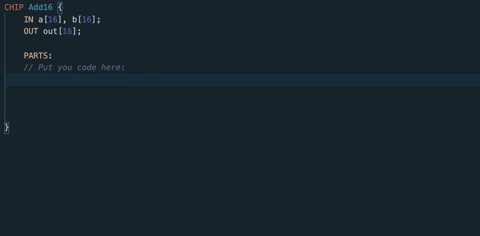
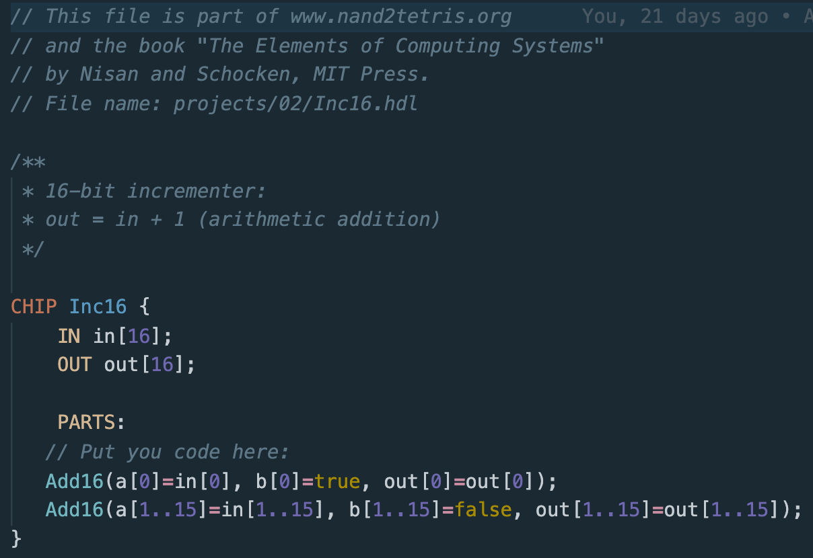
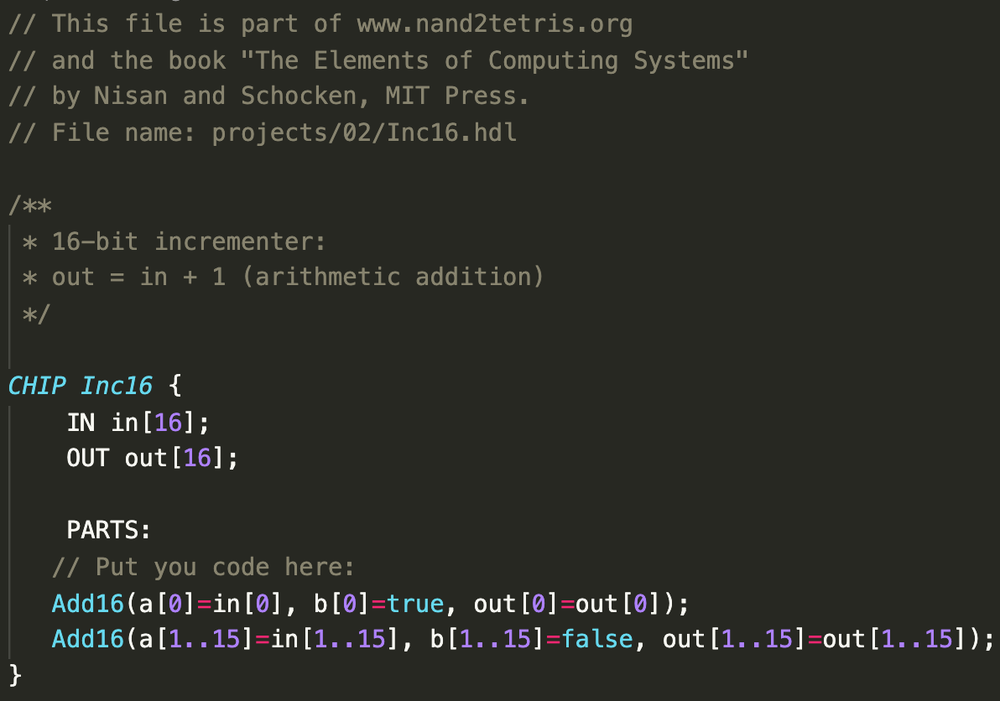
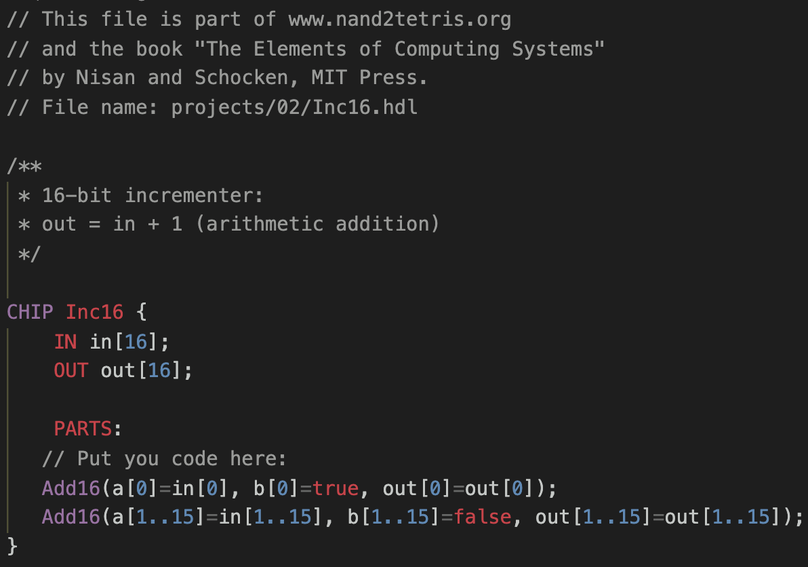

# Nand2Tetris HDL Language Support

## Usage

- To use the snippets and the syntax highlisghting set the langauge mode to HDL.

- Press `ctr`+`space` to see all the 37 chips.

## Syntax Highlighting

The Syntax Highlighting was developed primarly for [Noctis Minimum Theme](https://marketplace.visualstudio.com/items?itemName=liviuschera.noctis).

## Themes Examples

### Noctis Minimus

### Monokai

### Monokai Dimmed

