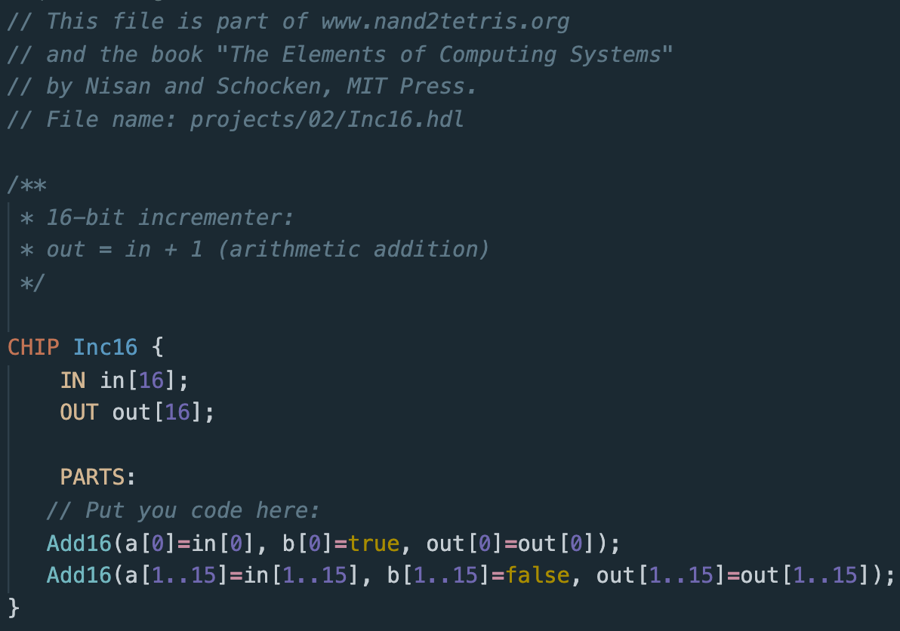

# Nand2Tetris HDL Language Support

## Features:

- Start typing "chip" and you'll be able to see all the 37 chips.

- Type individual chip names and they will also pop up.

- Press `tab` when you've filled out the snippet and it will create and take you to the new line.

The Syntax Highlighting was developed using Noctis Minimum Theme from [Noctis](img/Snippets.gif).

## Theme examples:

### Noctis Minimus

### Monokai

### Monokai Dimmed

